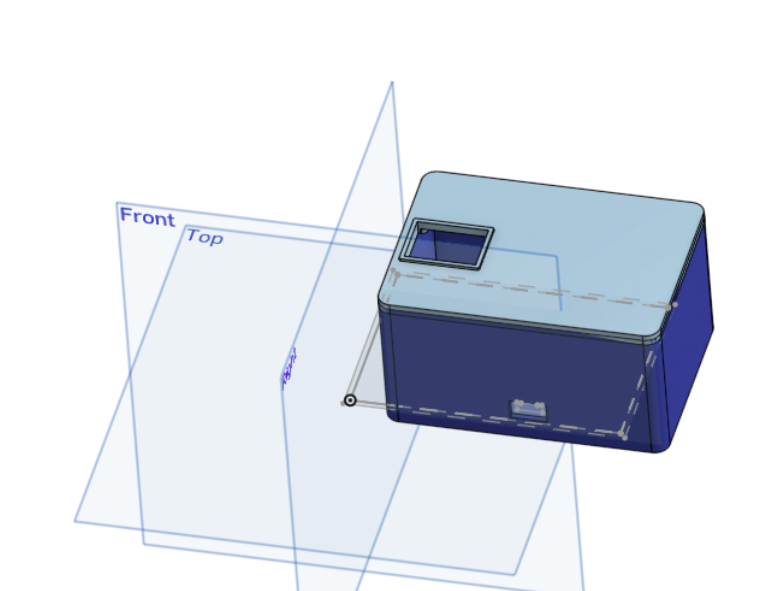
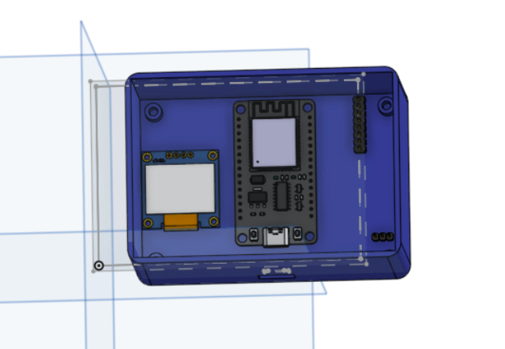
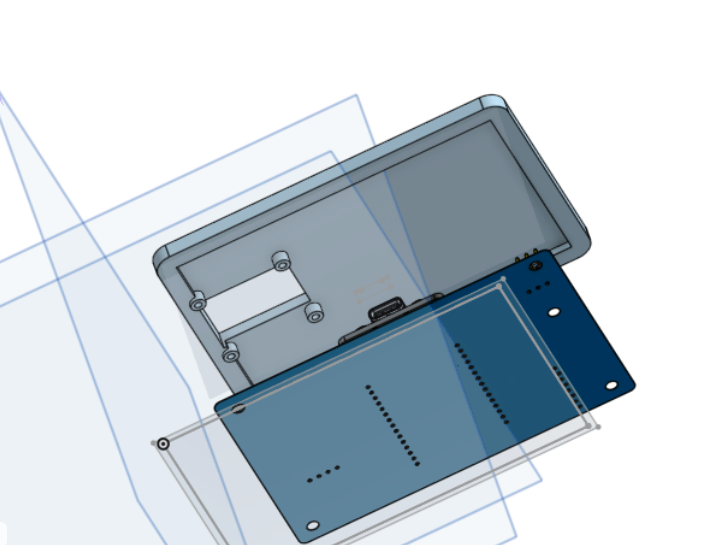
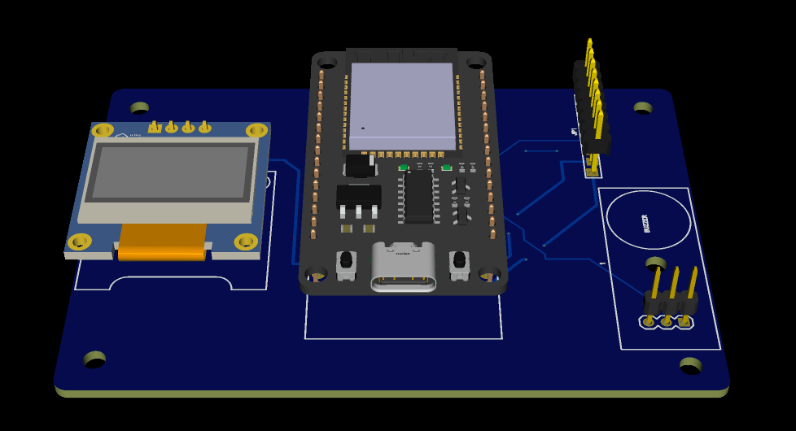

# Kinetix

Kinetix is desktop device that helps you focus and boosts your productivity with built-in gesture detection.

---

## Visuals & CAD Models

*Figure 1: Full 3D assembly render of the Kinetix enclosure.*

| Enclosure Box | Top Lid | PCB Layout |
| :---: | :---: | :---: |
|  |  |  |
| *Lower Body Enclosure* | *Lid with OLED Standoffs* | *Custom EasyEDA Board* |

## CAD Source
* **Onshape Model:** [Public Onshape Link](https://cad.onshape.com/documents/e95e5585e87df7a3d6d4791a/w/853263d332cfd8984b23feee/e/c8bdefc1633dfc214dc8225f?renderMode=0&uiState=6aae8fc8d6fb850115476be1)

---

## Repository Structure

* `/3d-prints`: 3D printable STL files (`kinetix_box.stl`, `Kinetix_lid.stl`)
* `/cad`: 3D STEP CAD models (`Kinetix_box.step`, `Kinetix_lid.step`)
* `/PCB`: Gerber manufacturing package and 3D PCB STEP file
* `/images`: Visual renders and CAD documentation screenshots
* `/src`: Firmware source code (`main.cpp`)
* `bom.csv`: Bill of Materials

---

Once the project is physically assembled, I plan to train an ML model for gesture detection and make it control the PC using it. It isn't possible or at least genuinely veryt difficult unless I physically have it.
